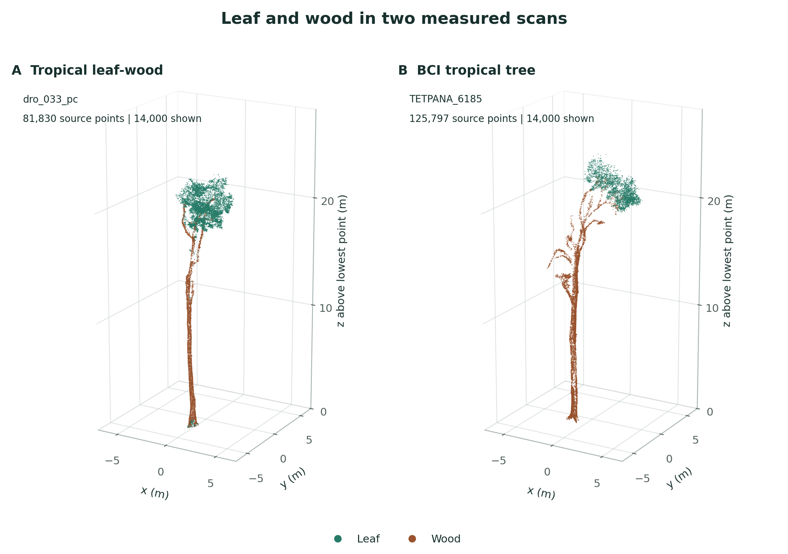
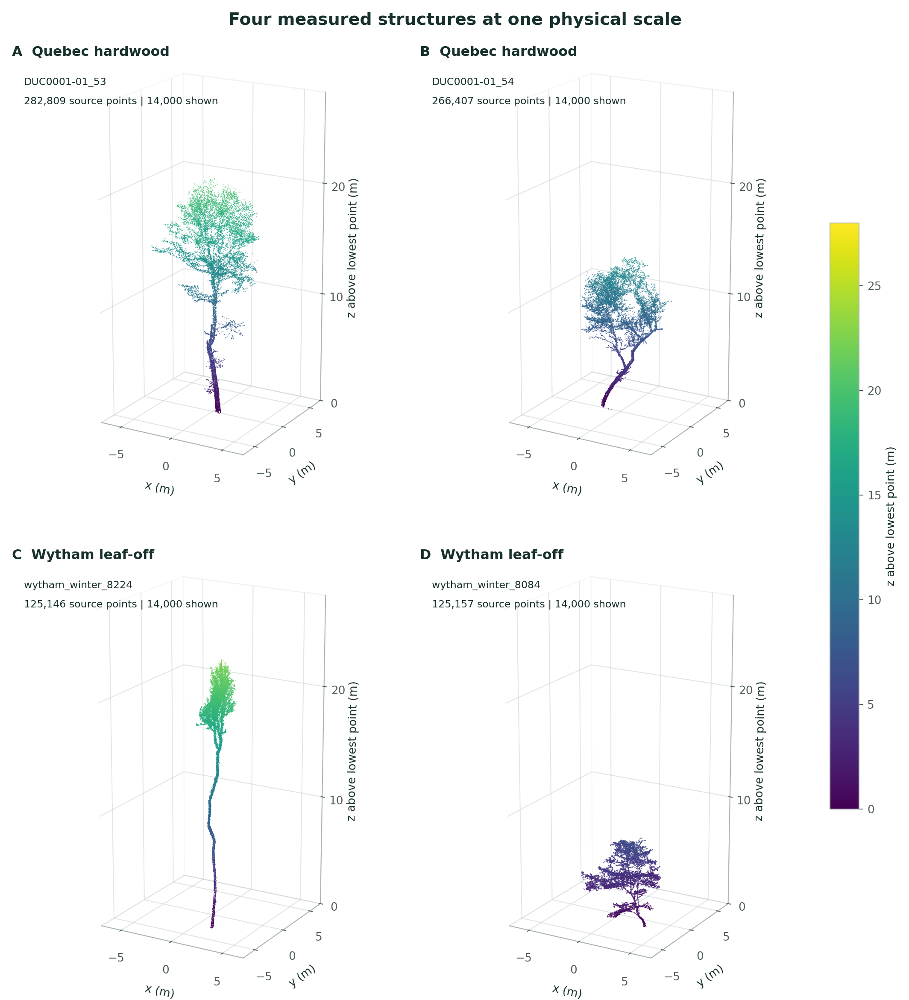
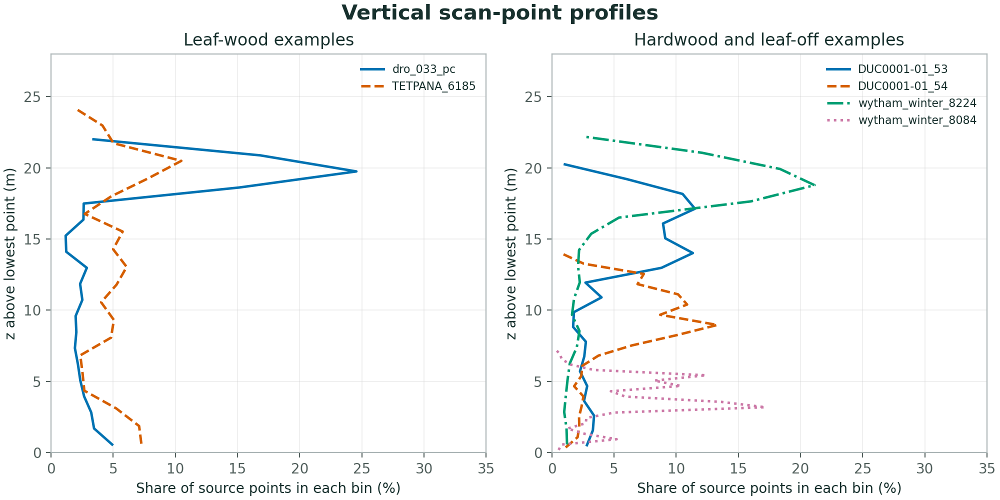

# Awesome Single-Tree Datasets

Real tree measurements, source papers, and example figures for tree geometry research.

This catalog lists laser scans and geometry from real images. It also lists related tree models and organ measurements.
Synthetic trees, procedural foliage, and simulated scans are outside its scope.

[Choose data](#choose-data) · [Example scans](#example-scans) · [Data sources](#data-sources) · [Basic analysis](#basic-analysis) · [Use limits](#use-limits)

## Choose data

| Research question | Relevant sources | Main limit |
|---|---|---|
| Where are leaf and wood points? | Tropical leaf-wood, BCI, HuashuTrees | Labels and seasonal scans have different meanings. |
| How well does a wood model match field measurements? | Quebec, Demol, Wytham, EucFACE | Model estimates and field references must stay separate. |
| How do tree species and shapes differ? | TreeML, FOR-species20K, Central European TLS | Some collections share source trees. |
| How can plot scans define tree instances? | TreeScanPL10K, SYSSIFOSS, TreeLearn | A tree ID does not prove complete geometry. |
| What is the shape of a needle or shoot? | Järvselja shoots | An organ is not a complete tree. |

## Example scans

These figures show selected measurements from four sources. They are examples, not a random sample of trees.
Each view contains at most 14,000 points. The 3D views use one physical coordinate scale per figure.

### Leaf and wood

**Tropical leaf-wood:** the source assigns leaf and wood labels to points.
**BCI:** leaf and wood classes come from separate files for one tree.
The colors show source classes. They do not show measured spectra.

### Tree structure

The Quebec panels show two different trees. The Wytham panels also show different trees, measured in the leaf-off season.
The common scale preserves size differences. Missing points can result from occlusion or limited sensor views.

Figure credits and licenses are in [Attribution](assets/figures/ATTRIBUTION.md).
Source members, sampling, and coordinate changes are in [Figure methods](docs/FIGURE_METHODS.md).

## Data sources

The counts below describe source releases or study populations. They do not give a combined count of unique biological trees.
Data licenses and paper licenses are separate.

### Tree scans and image measurements

| Source | Measurement | Source scope | Data / paper | Data license |
|---|---|---|---|---|
| **Tropical leaf-wood TLS** Australia | TLS | 148 trees | [Data](https://zenodo.org/records/13759407) · [Paper](https://doi.org/10.1016/j.isprsjprs.2025.06.023) | CC-BY-4.0 |
| **BCI tropical TLS** Panama | TLS | 201 trees; 176 trees with QSM | [Data](https://zenodo.org/records/15395386) · Paper link not confirmed | CC-BY-4.0 |
| **Quebec hardwood MLS** Canada | MLS | 98 trees | [Data](https://zenodo.org/records/21515256) · Paper link not confirmed | CC-BY-4.0 |
| **HuashuTrees** China, Nanjing | TLS | 159 trees; 318 seasonal scans | [Data](https://zenodo.org/records/19621699) · [Paper](https://doi.org/10.1038/s41597-026-08199-8) | Not confirmed for the data |
| **Demol TLS validation** Belgium | TLS | 65 trees | [Data](https://zenodo.org/records/4557401) · [Paper](https://doi.org/10.1007/s00468-020-02067-7) | CC-BY-4.0 |
| **EucFACE** Australia | TLS | 116 trees in the study; release population not confirmed | [Data](https://zenodo.org/records/16019825) · [Paper](https://doi.org/10.1016/j.agrformet.2025.110708) | CC-BY-4.0 |
| **Wytham Woods** United Kingdom | TLS, leaf-off | 876 released trees; 835 in paper analysis | [Data](https://zenodo.org/records/7307956) · [Paper](https://doi.org/10.1002/2688-8319.12197) | CC-BY-4.0 |
| **TreeML-Data** Germany, Munich | TLS, leaf-off | 3755 individual trees | [Data](https://doi.org/10.6084/m9.figshare.c.6788358.v1) · [Paper](https://doi.org/10.1038/s41597-023-02873-x) | CC0 |
| **BioDiv3DTrees** source study areas | TLS / ULS | 4952 point clouds; 3386 QSMs | [Data](https://doi.org/10.25625/8PB1IF) · [Paper](https://doi.org/10.1038/s41597-025-06421-7) | CC-BY-4.0 |
| **FOR-species20K** multi-region collection | TLS / MLS / ULS | over 20000 point clouds | [Data](https://zenodo.org/records/13255198) · [Paper](https://doi.org/10.1111/2041-210X.14503) | GPL-3.0-or-later (record) |
| **Central European TLS trees** Czech Republic | TLS | 3618 segmented scan clouds | [Data](https://doi.org/10.48700/datst.xkadt-0cb92) · [Paper](https://doi.org/10.1016/j.dib.2026.113021) | CC-BY-NC-4.0 |
| **SYSSIFOSS** Germany | TLS / ULS / ALS | 12 plots; no unique tree count stated | [Data](https://doi.org/10.1594/PANGAEA.942856) · [Paper](https://doi.org/10.5194/essd-14-2989-2022) | See the source record |
| **TreeScanPL10K** Poland | TLS plot clouds with tree IDs | Paper: 10417 trees; release table: 10447 source-file/treeID keys; 272 plots | [Data](https://zenodo.org/records/19127709) · [Paper](https://doi.org/10.1038/s41597-026-07269-1) | CC-BY-4.0 |
| **IRLTrees3D** Ireland | Image-based reconstruction | Tree subset count not confirmed | [Data](https://IRLTrees3D.reliable-ai.org) · [Paper](https://openaccess.thecvf.com/content/ICCV2025W/SEA/papers/Chai_IRLTrees3D_A_3D_Reconstruction_Dataset_of_Trees_ICCVW_2025_paper.pdf) | Not confirmed for the data |
| **Shivalik lidar** India | TLS / ALS | Source count not confirmed | [Data](https://zenodo.org/records/15362444) · [Paper](https://doi.org/10.1038/s41597-026-06674-w) | CC-BY-4.0 metadata; restricted data access |

Source attributes and limits

**Tropical leaf-wood TLS**

XYZ; leaf=0 / wood=1; manually annotated.

The source has manual leaf and wood labels. Preserve the source training, validation, and test groups.

**BCI tropical TLS**

Separate leaf/wood point clouds; repeated QSM fits.

Leaf and wood files can describe the same tree. Several QSM fits can describe one tree. The source has no confirmed paper link.

**Quebec hardwood MLS**

LAZ; QSM; destructive volume; DBH; field measurements.

Tree IDs connect scans, QSMs, and field attributes. The source names a related manuscript. Its publication DOI is not confirmed.

**HuashuTrees**

Leaf-on and leaf-off pairs; field attributes.

Two seasonal scans can describe one tree. A sample release can overlap the full release. The article license does not establish the data license.

**Demol TLS validation**

Clean scan clouds; QSM; destructive biomass/density.

QSMs describe wood reconstructed from scans. Model file counts can differ from biological tree counts.

**EucFACE**

Individual tree clouds; QSM; analysis code.

The study reports 116 trees. The release population can differ from the study population.

**Wytham Woods**

PLY scan clouds; optimal QSM; analysis.

The release has 876 trees. The study uses 835 trees. PLY and TXT files can describe the same tree.

**TreeML-Data**

Point clouds; QSM; graphs; transforms; tree/QSM attributes.

The source covers 40 urban surveys. QSMs and graphs are derived models. Source coordinate transforms are necessary for spatial analysis.

**BioDiv3DTrees**

Scan clouds; species labels; QSM; graphs.

TLS, ULS, QSMs, and graphs can describe the same trees. Counts from these forms must not be added.

**FOR-species20K**

Species metadata; mixed scanning modalities.

This collection includes other sources. Its test species labels are withheld. Component data can have different license terms.

**Central European TLS trees**

Leaf-on/off scans; measured traits; structural metadata.

Only the measured scan subset is in scope. Procedural foliage and simulated ALS are excluded. Subsets can overlap the full release.

**SYSSIFOSS**

Matched scan modalities; traits; acquisition metadata.

The source connects measurements from different platforms. PyTreeDB is a source index. It is not a separate population of trees.

**TreeScanPL10K**

Plot point clouds: treeID, treeSP, completelyInside. Release table: species, species_code, completely_inside.

The paper and release table have different counts. The reason is unknown. The boundary flag does not measure occlusion.

**IRLTrees3D**

Images; scan-derived geometry; reconstruction benchmark.

Geometry comes from real images. The tree subset needs a source inventory. Images, meshes, and 3DGS are different data forms.

**Shivalik lidar**

Leaf/wood classification and field references.

Source data access is restricted. The source pointer can resolve to version 17566270. An open paper does not imply open data.

### Organs, stems, and tree instance benchmarks

- **[Järvselja shoots](https://doi.org/10.17632/rs3f6trdvw.1)** — 10 measured shoots. The measurements describe shoots and needles. These organs are not complete trees. [Paper](https://doi.org/10.1016/j.rse.2023.113568).
- **[TreeLearn](https://github.com/ecker-lab/TreeLearn)** — 156 manually annotated benchmark trees; 6665 automatically labelled training trees. Manual benchmark labels and automatic training labels have different roles. They must be kept separate. [Paper](https://arxiv.org/pdf/2309.08471).
- **[DigiForests](https://www.ipb.uni-bonn.de/data/digiforest-dataset/)** — Repeated plots; no unique tree count stated. Repeated surveys can measure the same trees. The linked project report is not a journal article. [Project report](https://digiforest.eu/assets/deliverables/D7_2.pdf).
- **[TreeScope](https://treescope.org/)** — More than 1800 reference stems. This benchmark describes stems. It does not establish complete crown geometry. [Paper](https://arxiv.org/pdf/2310.02162).

## Basic analysis

### Vertical point profiles

Each curve shows the share of source points in a vertical bin. The counts use all finite points in each example.
The profiles describe the scan samples. They do not measure leaf area, branch volume, or sensor accuracy.

### TreeScanPL10K source table

The release table has **10,447 distinct source-file/treeID keys**. It has **7,468 rows with a source label other than unknown**.
These rows include 530 genus-level `Quercus species` labels. The labels do not all identify species.
The paper reports **10,417 trees** and **7,465 species labels**. The reason for this difference is unknown.

The median source height attribute is **17.82 m**. The median source point count is **307,639**.
The table has **35 rows below 1,000 points**. Three rows contain one point.
The three one-point records also have zero height attributes. A source tree ID therefore does not establish useful tree geometry.

The boundary flag marks **9,525 rows as completely inside the plot**. This flag does not establish complete sensor coverage.
All table rows remain in the analysis. A source-table row is not proof of a unique tree across plots.

The definitions and source fields are in [Analysis methods](docs/ANALYSIS.md).
The numerical results are in [example_statistics.json](catalog/example_statistics.json).

## Use limits

1. Check source units, axes, and coordinate transforms before you compare geometry.
2. Keep biological tree IDs separate from observation IDs.
3. Treat seasonal scans, component files, QSM fits, and graphs as related records.
4. Check shared source trees before you make training and test groups.
5. Check occlusion, plot boundaries, foreign points, and labels before you use a tree instance.
6. Use the data license from the data source.

A QSM reconstructs wood from measurements. It is not a new scan or a measured leaf crown.
Source flags and labels do not replace a geometry check.

## Catalog and contributions

- [Source catalog: CSV](catalog/datasets.csv) · [JSON](catalog/datasets.json)
- [Paper references](catalog/references.bib)
- [Inclusion policy](docs/INCLUSION_POLICY.md)
- [Tree identity and attributes](docs/INSTANCE_SCHEMA.md)
- [Terms and writing principles](docs/WRITING_STYLE.md)
- [Contribution guide](CONTRIBUTING.md)

This repository publishes source information, analysis, and attributed figures. The current version excludes personal acquisition records and raw scan files.
Original text uses the [MIT license](LICENSE). Third-party data and derived figures keep the licenses stated in their attribution.
