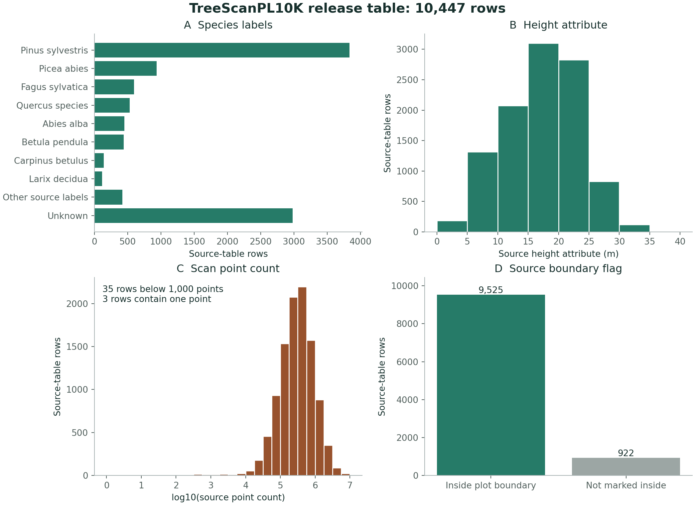

# Basic source analysis

## TreeScanPL10K

Source: [Zenodo record 19127709](https://zenodo.org/records/19127709).
Paper: [TreeScanPL10K](https://doi.org/10.1038/s41597-026-07269-1).
Table: `individual_tree_summary.csv`.

The analysis uses all 10,447 rows in this release table. All `(source_file, treeID)` keys are distinct.
This key distinguishes source records. It does not prove biological identity across plots.

### Count definitions

| Measure | Definition | Result |
|---|---|---:|
| Release rows | All source-table rows. | 10,447 |
| Non-unknown labels | The species field is not `unknown`. | 7,468 |
| Unknown labels | The species field is `unknown`. | 2,979 |
| Inside boundary | `completely_inside` equals 1. | 9,525 |
| Low point count | `point_count` is below 1,000. | 35 |
| One-point record | `point_count` equals 1. | 3 |
| Median height | Median of `height_m` across all rows. | 17.82 m |
| Median point count | Median of `point_count` across all rows. | 307,639 |

The paper reports 10,417 trees and 7,465 species labels. The table gives different counts.
No cause for the difference is inferred.

The non-unknown labels include 530 rows named `Quercus species`. This label identifies a genus, not a species.
The source has 30 non-unknown label values. They are not 30 independently confirmed species.

### Figure definitions

**Panel A:** eight most frequent non-unknown labels, other source labels, and unknown labels. Counts use all rows.

**Panel B:** the source height attribute in 5 m bins. Counts use all rows, including zero values.

**Panel C:** positive source point counts on a log10 scale. All rows have positive point counts.

**Panel D:** the source boundary flag. The two categories include all rows.

The source table has 272 distinct source files. The analysis does not split data into training and test groups.
The source labels are not independently checked. No point clouds are assessed by these table statistics.

### Interpretation

The source includes strongly unequal species counts. Species classification studies need to account for this imbalance.
Low point counts require separate geometry checks. A tree ID alone does not establish a useful instance.

The boundary flag addresses the plot boundary. It does not measure occlusion or missing fine branches.
The height values are source attributes. They are not new field measurements.
All three zero-height rows are one-point records. This relationship does not establish the method for every source height attribute.

The table repeats treeID values across source files. A source_file and treeID pair is necessary to identify a record.

## Cross-source comparison

TLS, MLS, ULS, and ALS observe trees from different positions. Their point counts are not direct measures of tree size.
Distance, scan design, occlusion, and object size can affect point counts.

FOR-species20K combines component sources. Its development table includes `Weiser_2022a`, `Weiser_2022b`, and `Calders_2022`.
These names suggest links to SYSSIFOSS and Wytham. Tree identity still needs direct source matching.

Seasonal pairs are repeated measurements. Leaf and wood files are components.
QSMs and graphs are derived models. These categories must not be added as separate trees.

## Reproduction

The definitions above and [numerical results](../catalog/example_statistics.json) describe the analysis.
The [source member list](../catalog/figure_examples.json) describes the example scans and display changes.
Source data remain with their publishers.
